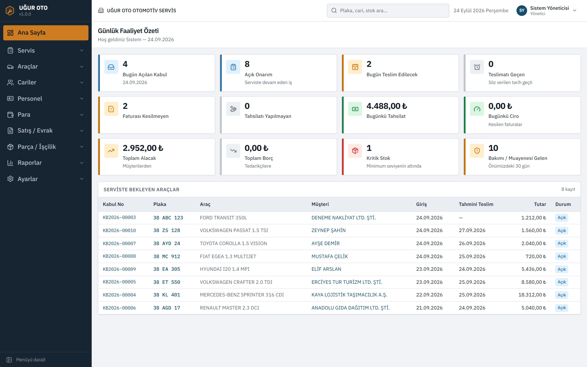
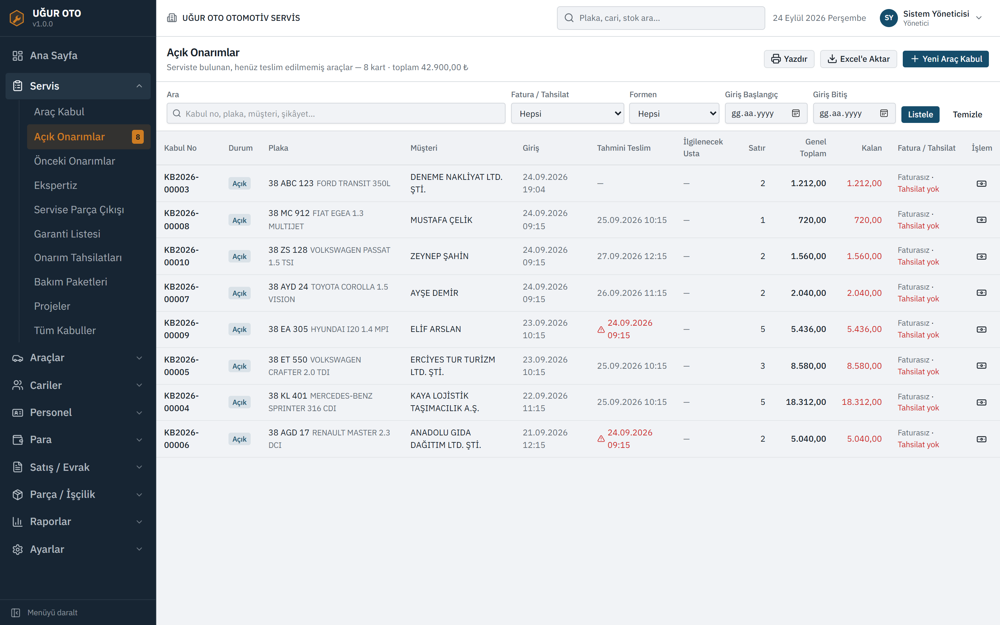
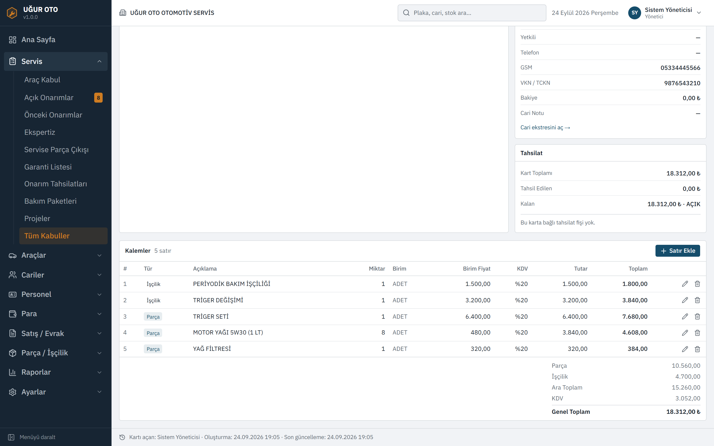
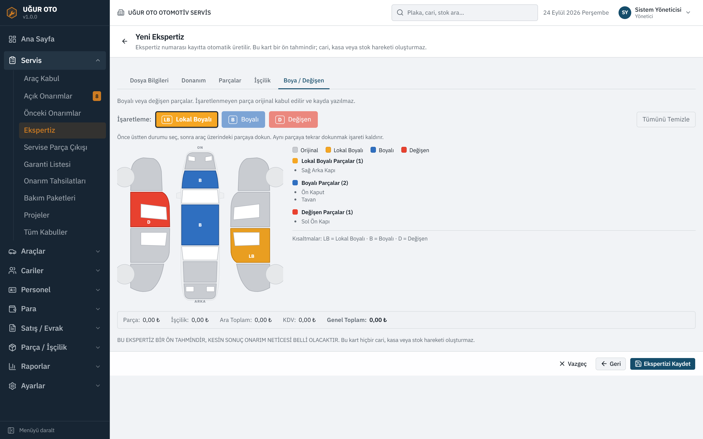
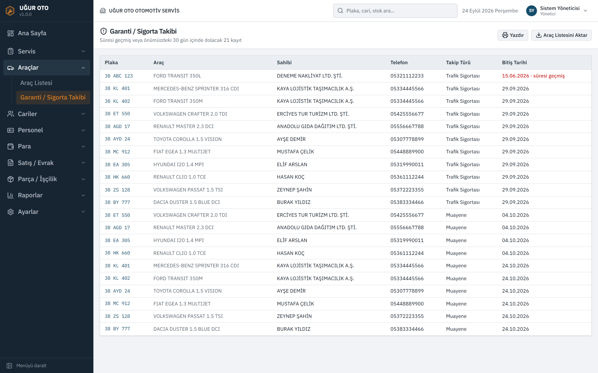
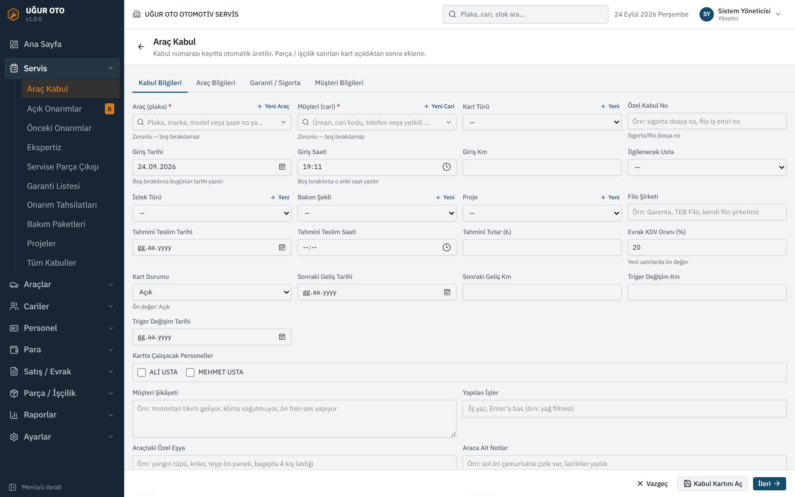
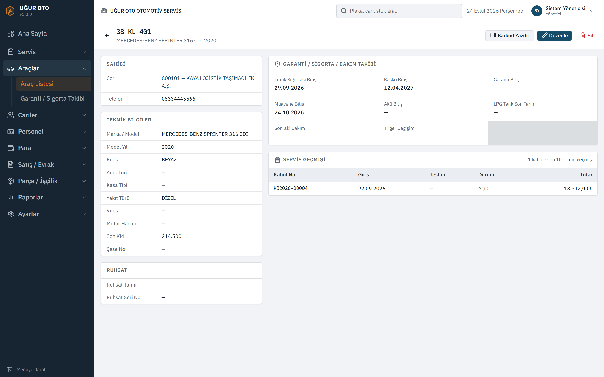
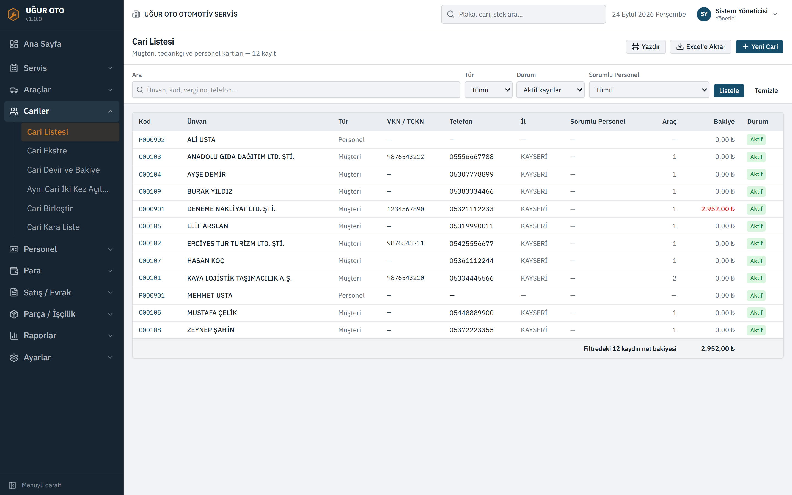
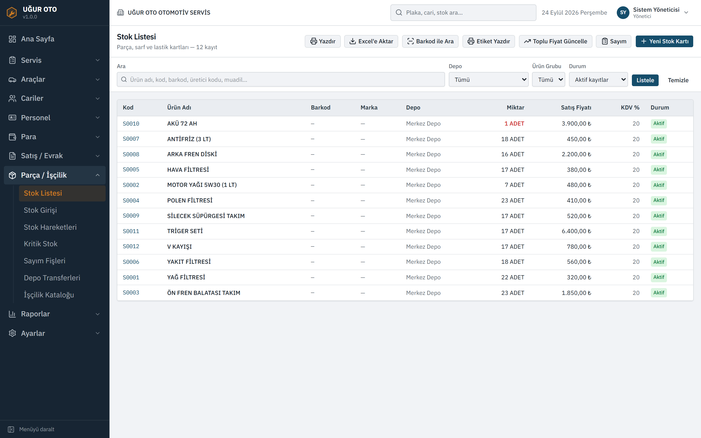

# Servis Pro ERP

**Oto servis işletmeleri için web tabanlı ERP.** Araç kabulünden faturaya, stoktan cari hesaba kadar bir servisin günlük işini tek ekranda toplar.

Ankara'da faaliyet gösteren bir oto servis işletmesi için sıfırdan geliştirildi, Eylül 2026'dan beri **işletmede her gün aktif olarak kullanılıyor.** İşletmenin eski Access tabanlı masaüstü programının yerini aldı.

> 🇬🇧 **In English:** A full-stack ERP for auto repair shops (vehicle intake, work orders, inventory, accounts receivable/payable, invoicing, 30+ reports). Built from scratch for a real client in ~3 weeks and in daily production use since September 2026, replacing a legacy MS Access system. Stack: Next.js 16 · React 19 · TypeScript · Prisma · PostgreSQL · Auth.js · Vercel.



---

## Öne çıkanlar

| | |
|---|---|
| ⏱️ **Süre** | 3 hafta (ilk commit → canlıya alma), tek geliştirici |
| 🏭 **Durum** | Gerçek müşteride canlı kullanımda |
| 🗄️ **Veri modeli** | 41 tablo, 37 migration |
| 📊 **Raporlar** | 30+ rapor (kârlılık, KDV, yaşlandırma, ölü stok, gün sonu…) |
| 🖨️ **Baskılar** | 18 baskı şablonu (fatura, irsaliye, kabul formu, barkod, ekspertiz…) |
| 🔄 **Veri taşıma** | Eski Access veritabanından 767 cari, 844 araç ve 727 stok/işçilik kaydı aktarıldı |

## Modüller

- **Servis:** araç kabul / iş emri, açık ve kapalı onarımlar, "araç nerede?" takibi, parça çıkışı, bakım paketleri, garanti ve sigorta takibi, ekspertiz (eksper sureti formu + boya/değişen şeması)
- **Araçlar:** araç kartları, marka/model kataloğu, servis geçmişi, muayene ve bakım hatırlatmaları
- **Cari hesaplar:** müşteri, tedarikçi ve personel kartları, ekstre, mizan, filo sözleşmeleri, kara liste, mükerrer cari tespiti ve birleştirme
- **Tahsilat / Kasa:** tahsilat ve tediye, kasa defteri, virman, çek-senet
- **Stok:** parça kartları, giriş fişi, depolar arası transfer, sayım, minimum stok uyarısı, toplu fiyat güncelleme, barkod ve etiket
- **Fatura / Evrak:** satış, alış, servis faturası, hızlı satış, irsaliyeli ve tevkifatlı fatura, iade
- **Sipariş ve teklif:** alınan ve verilen siparişler
- **Personel:** usta kartları, mesai ve puantaj, personel bazlı satış/tahsilat
- **Raporlar:** 30+ hazır rapor, Excel'e aktarma
- **Ayarlar:** firma bilgileri, kullanıcılar, rol ve istisna tabanlı yetki, işlem logu, tanımlar

## Ekran görüntüleri

| | |
|---|---|
|  |  |
| Açık onarımlar | Kabul kartı ve kalemler |
|  |  |
| Ekspertiz: boya / değişen şeması | Garanti ve sigorta takibi |
|  |  |
| Araç kabul formu | Araç kartı |
|  |  |
| Cari listesi | Stok listesi |

*Ekran görüntülerinde yalnızca örnek (demo) veri vardır.*

## Teknik yapı

| Katman | Teknoloji |
|---|---|
| Uygulama | Next.js 16 (App Router, Server Components, Server Actions), React 19 |
| Dil | TypeScript |
| Veritabanı | PostgreSQL (Neon), Prisma ORM, migration tabanlı şema yönetimi |
| Kimlik doğrulama | Auth.js (NextAuth v5), bcrypt |
| Formlar ve doğrulama | React Hook Form, Zod |
| Arayüz | Tailwind CSS 4, shadcn/ui, Radix UI, TanStack Table |
| Diğer | JsBarcode (barkod), Nodemailer (haftalık özet e-postası), Vercel Cron |
| Yayın | Vercel |

### Bazı mühendislik kararları

- **İki katmanlı yetki sistemi:** Rol modüle varsayılan erişimi belirler. Kullanıcıya özel istisna kaydı varsa rolü ezer. Böylece "bu usta stok da girebilsin" gibi tek kişilik istekler yeni rol açmadan karşılanıyor ([`src/lib/yetki.ts`](src/lib/yetki.ts)).
- **Sayı okuma tek kaynakta:** Türkçe ondalık ayıracı (`1.250,50`) ile veritabanından gelen makine biçimi (`1250.5`) karışınca, düzenlenip tekrar kaydedilen bir tutarın 10 katına çıkabildiği bir hata yakalandı. Her modüldeki ayrı kopyalar kaldırılıp sayı okuma tek bir modüle indirildi ([`src/lib/sayi.ts`](src/lib/sayi.ts)).
- **Çakışmaya dayanıklı belge numaralandırma:** Numara "en büyüğü bul, bir artır" yöntemiyle üretilmiyor. Veritabanındaki tek satırlık sayaç transaction içinde atomik olarak artırılıyor. Böylece aynı anda kayıt açan iki kullanıcı aynı fatura numarasını alamıyor ([`src/lib/numarator.ts`](src/lib/numarator.ts)).
- **Silme yerine iz bırakma:** Finansal kayıtlar kalıcı olarak silinmiyor, "silindi" olarak işaretleniyor. Bakiyeler geri alınıyor ve her işlem loglanıyor. Loglar haftalık e-posta özetiyle birlikte otomatik budanıyor.
- **Sunucusuz uyumlu veritabanı bağlantısı:** Uygulama havuzlu (pooled) bağlantıyı, migration'lar doğrudan bağlantıyı kullanıyor.
- **Eski sistemden veri taşıma:** Access veritabanı PowerShell/ODBC ile JSON'a döküldü, sonra tek seferlik TypeScript script'leriyle yeni şemaya aktarıldı. Mükerrer kayıtlar birleştirildi, hatalı model ve yıl bilgileri düzeltildi ([`prisma/`](prisma/) altındaki `ice-aktar-*.ts` dosyaları).

## Yerelde çalıştırma

```bash
npm install
cp .env.example .env          # DATABASE_URL, DIRECT_URL, AUTH_SECRET değerlerini doldur
npx prisma migrate deploy
npm run db:seed:demo          # temel tanımlar + örnek veri
npm run dev
```

Seed, `SEED_ADMIN_SIFRE` ortam değişkeniyle bir yönetici kullanıcısı oluşturur.

## Geliştirici

**İsmet Güler**, Erciyes Üniversitesi Bilgisayar Mühendisliği
[GitHub](https://github.com/IsmetGuler) · [LinkedIn](https://www.linkedin.com/in/ismet-g%C3%BCler-0b7ba8351) · [Portfolyo](https://ismetguler.github.io)

---

<sub>Bu depo portfolyo amacıyla yayınlanmıştır. Kod, müşteri izniyle paylaşılmaktadır. Tüm hakları saklıdır.</sub>
